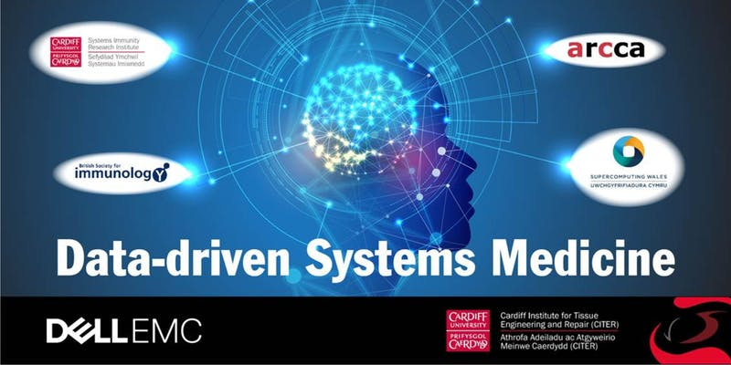

DELL EMC, ATOS and Partners are delighted to be hosting Data-driven systems medicine workshop at the Cardiff University Brain Research Imaging Centre (CUBRIC) on June 11th-12th, 2019, Maindy Road, CF24 4HQ Cardiff. There are places available for Jun 12th only. If you are interested to attend, please contact the Organisers.

The aim of this day and a half long workshop is to gather a multi-disciplinary group of experts from both Academia and IT/Parmaceutical Industry who recognize the applicability of machine learning and computational methods in systems medicine, as a first step on the path to personalised medicine. They will discuss the ways that artificial intelligence and systems modelling can be applied to issues relating to medicine and healthcare using best practice to detail the synergies and interfaces between the different scientific communities and IT industry.

The event will run from *12pm-5pm June 11th to 8.45am-4pm June 12th* and will host 15 invited speakers. The workshop is intended for senior PhD students, postdocs, researchers, academics and representatives of Industry with interest/background in the area of data/health science and systems medicine. Up to 15 poster boards are also available. Please contact szomolayb@cardiff.ac.uk with any inquiries.

<h1>Day One</h1>

**12.00-12.30** registration

**12.30-12.35** Opening - [Prof. Roger Whitaker](https://www.cardiff.ac.uk/people/view/118176-whitaker-roger) (Supercomputing Wales):

**12.35-13.05** Talk 1 - <u>[Dr. Rob Orford](https://gweddill.gov.wales/topics/health/professionals/scientific/?lang=en) (Welsh Government)</u>:
_A Healthier Wales – the new era health and social care?_

**13.05- 13.10** questions

**13.10-13.40** Talk 2 - <u>[Dr. Phil Webb](https://www.linkedin.com/in/phil-webb-9b8ba97/?originalSubdomain=uk) (Velindre NHS University Trust)</u>:
_The Art and Science of Conversation in Modern Healthcare_

**13.40-13.45** questions

**13.45-14.15** coffee

**14.15-14.45** Talk 3 - <u>[Mr. Richard Rawcliffe](https://www.linkedin.com/in/rrawcliffe/?originalSubdomain=uk) (DELL)</u>:
_Dell EMC Technologies, Solutions for Healthcare and Life Sciences_

**14.45-14.50** questions

**14.50-15.20** Talk 4 - <u>[Prof. Irena Spasic](https://users.cs.cf.ac.uk/I.Spasic/) (Cardiff University)</u>:
_Text mining of healthcare narratives for cohort selection in clinical trials_

**15.20-15.25** questions

**15.25-15.55** coffee

**15.55-16.25** Talk 5 - <u>[Prof. Martyn Guest](https://www.cardiff.ac.uk/people/view/401189-guest-martyn) (ARCCA)</u>:
_Delivering Infrastructure and Support for Research Computing_

**16.25-16.30** questions

**16.30-17.00** Talk 6 - <u>[Simon Elwood-Thompson](https://www.swansea.ac.uk/staff/medicine/operationaltechnicalstaff/ellwood-thompsons/) (SAIL databank)</u>:
_UK Secure e-Research Platform (UKSeRP) - all data’s the same but different_

**17.00-17.05** questions

<h1>Day Two</h1>

**8.45-9.15** Talk 7 - <u>[Prof. Benedict Seddon](https://scholar.google.co.uk/citations?user=Hf2VV4EAAAAJ&hl=en) (University of Oxford)</u>:
_Sources and mixtures - recipes for immunological memory_

**9.15-9.20** questions

**9.20-9.50** Talk 8 - <u>[Prof. Mark Coles](https://scholar.google.co.uk/citations?user=fPEUWWYAAAAJ&hl=en) (University College London)</u>:
_Data driven mechanistic modelling for targeting cancer and immune mediated inflammatory disease_

**9.50-9.55** questions

**9.55-10.25** Talk 9 - <u>[Dr. Venkatesh Pilla Reddy](https://scholar.google.com/citations?user=3zkrFSoAAAAJ&hl=en) (AstraZeneca)</u>:
_PK/PD modelling for targeting brain tumours: the importance of PET imaging_

**10.25-10.30** questions

**10.30-11.00** coffee

**11.00-11.30** Talk 10 - <u>Dr. Piotr Ostrowski (GSK)</u>:
_Modelling and image analysis for vascular brain conditions_

**11.30-11.35** questions

**11.35-12.05** Talk 11 - <u>[Dr. Ceire Costelloe](https://www.imperial.ac.uk/people/ceire.costelloe) (Imperial College London)</u>:
_Using real world data to drive precision medicine across the UK healthcare economy_

**12.05-12.10** questions

**12.10-12.40** Talk 12 - <u>[Dr. Manasi Nandi](https://www.kcl.ac.uk/lsm/research/divisions/ips/about/people/nandi) (King's College London)</u>:
_Attractor reconstruction for the earlier detection of sepsis: where maths meets medicine_

**12.40-12.45** questions

**12.45-13.45** lunch

**13.45-14.15** Talk 13 - <u>[Dr. Christopher Yau](https://www.birmingham.ac.uk/staff/profiles/cancer-genomic/yau-christopher.aspx) (University of Birmingham)</u>:
_Machine learning for the molecular determinants of human disease_

**14.15-14.20** questions

**14.20-14.50** Talk 14 - <u>[Dr. Sascha Ott](https://warwick.ac.uk/fac/sci/dcs/people/sascha_ott/) (University of Warwick)</u>:
_Single-cell RNA sequencing in reproductive medicine_

**14.50-14.55** questions

**14.55-15.25** Talk 15 - <u>[Dr. Timothy Bowen](https://www.cardiff.ac.uk/people/view/122808-bowen-timothy) (Cardiff University)</u>:
_Systems approaches to translational nephrology_

**15.25-15.30** questions

**15.30-16.00** coffee

